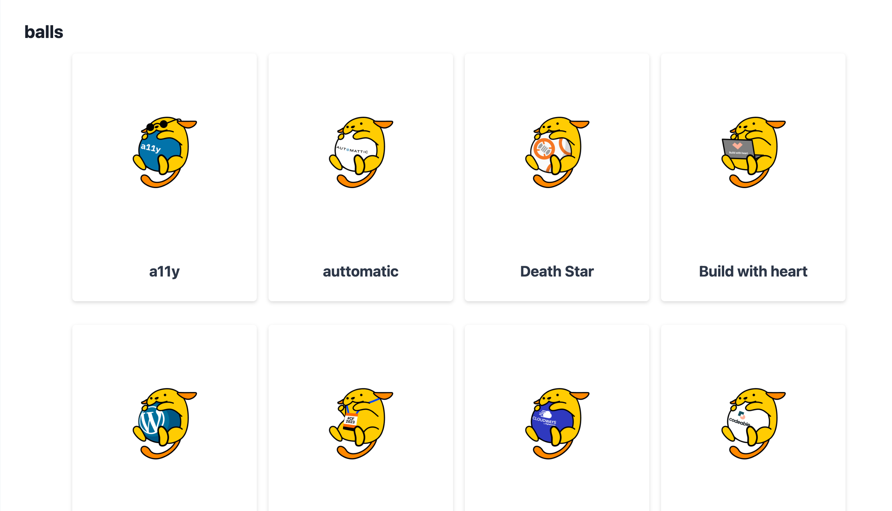

# WapuuGotchi Collection Preview

WapuuGotchi Collection Preview is a WordPress plugin that fetches data and displays items from the WapuuGotchi API using Flexbox CSS in a card style. It provides a shortcode `[wapuugotchi_collection_preview]` to display the collection preview on any post or page.

## Installation

1. Download the [latest release](https://github.com/coachbirgit/wapuugotchi-collection-preview/releases/latest) from GitHub.
2. Upload the `wapuugotchi-collection-preview` folder to the `/wp-content/plugins/` directory of your WordPress installation.
3. Activate the plugin through the 'Plugins' menu in WordPress.
4. Use the shortcode `[wapuugotchi_collection_preview]` in your posts or pages to display the WapuuGotchi Collection Preview.

## Frequently Asked Questions

### How do I use the plugin?

After activating the plugin, simply use the shortcode `[wapuugotchi_collection_preview]` in your posts or pages to display the WapuuGotchi Collection Preview.

### Can I customize the appearance of the collection preview?

Yes, you can customize the appearance by editing the `style.css` file in the `wapuugotchi-collection-preview` folder. Please note that changes to the plugin files may be lost when updating the plugin.

## Changelog

### 1.0

* Initial release

## License

WapuuGotchi Collection Preview is released under the [GNU General Public License v2.0](LICENSE).
